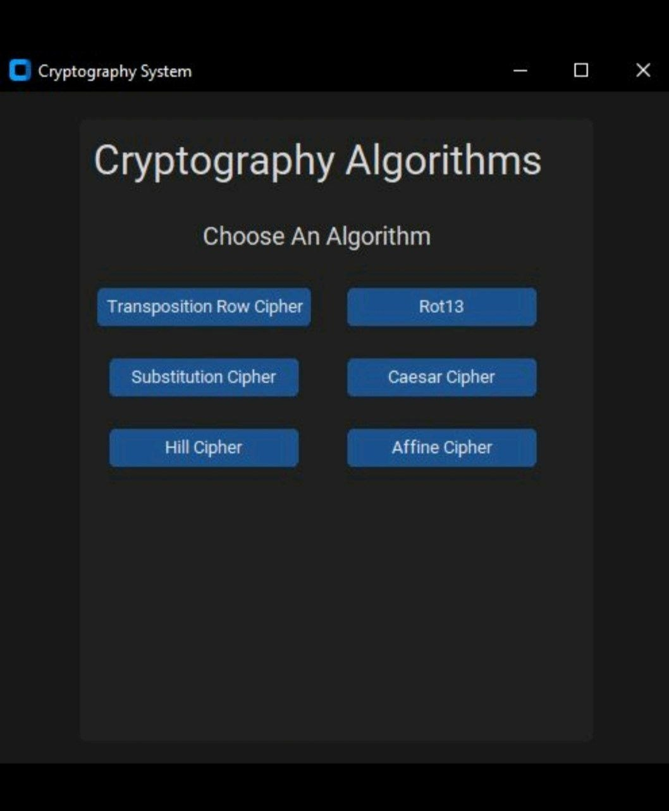
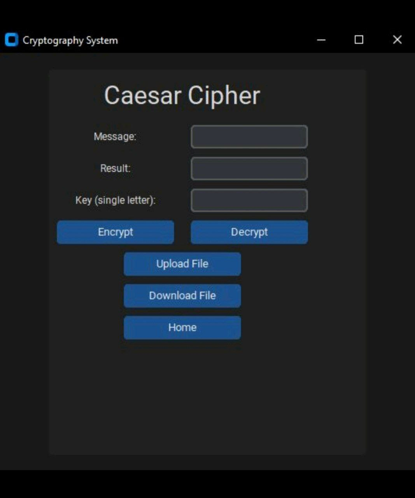

# 🔐 Cryptography System

A Python desktop application featuring **6 classical encryption and decryption algorithms** with a modern dark UI, file upload/download support, and a clean navigation system.

---

<div align="center">


</div>

---

## 📸 Screenshots

<div align="center">

| Home Screen | Cipher Screen |
|:---:|:---:|
|  |  |
| **Algorithm Selection** | **Encrypt / Decrypt** |

</div>

---

## ✨ Features

**6 Supported Algorithms:**

| # | Algorithm | Key Type |
|:---:|:---|:---|
| 1 | 🔄 **Transposition Row Cipher** | Letters |
| 2 | 🔁 **ROT13** | No key needed |
| 3 | 🏛️ **Caesar Cipher** | Single letter |
| 4 | 🔀 **Substitution Cipher** | 26-letter alphabet key |
| 5 | 🧮 **Hill Cipher** | Square matrix of letters (2x2 or 3x3) |
| 6 | ➗ **Affine Cipher** | Two letters (Key A coprime with 26, Key B) |

**Additional Features:**
- 📤 Upload `.txt` files as input
- 📥 Download encrypted/decrypted result as `.txt` file
- 🌙 Dark mode UI using CustomTkinter
- 🏠 Home navigation from every screen

---

## 🛠️ Tech Stack

| Layer | Technology |
|:---|:---|
| 🐍 Language | Python |
| 🖥️ GUI | CustomTkinter |
| 📂 File Handling | tkinter.filedialog |
| 🧮 Math | Python `math.gcd` |

---

## 🚀 Getting Started

**1. Install dependencies:**
```bash
pip install customtkinter
```

**2. Run the app:**
```bash
python main.py
```

---

## 📌 Project Status

> ✅ **Completed** &nbsp;&nbsp;|&nbsp;&nbsp; 🔒 **Source Code: Private**

---

<div align="center">

*Made with 🔐 by Youssef Hesham*

</div>
